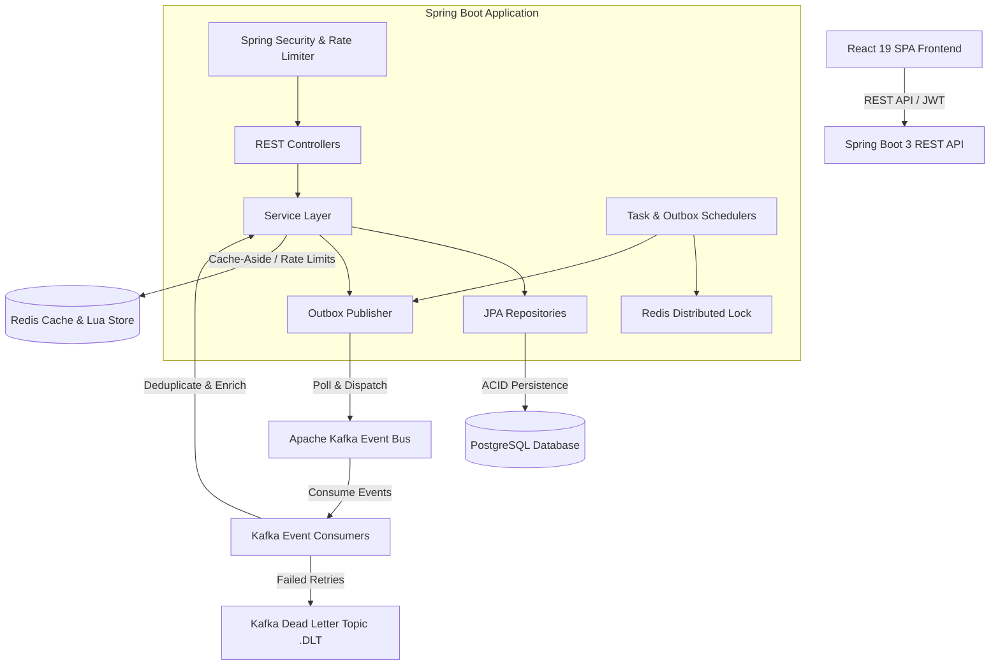
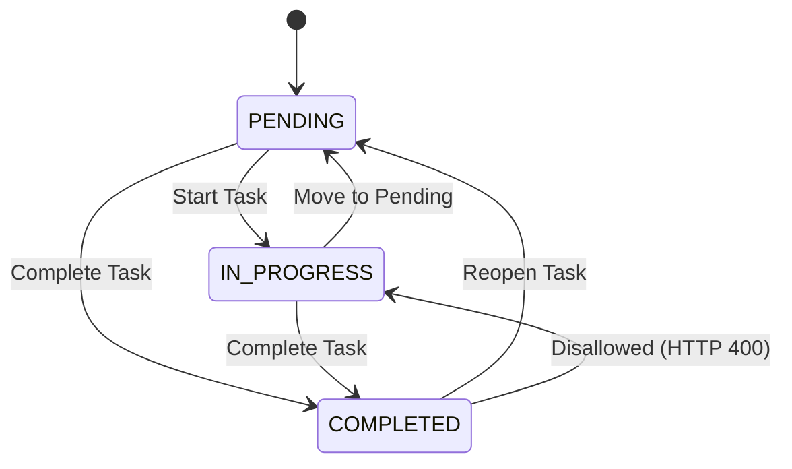
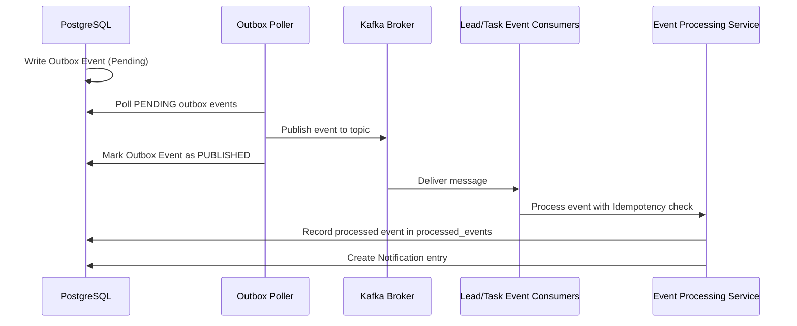
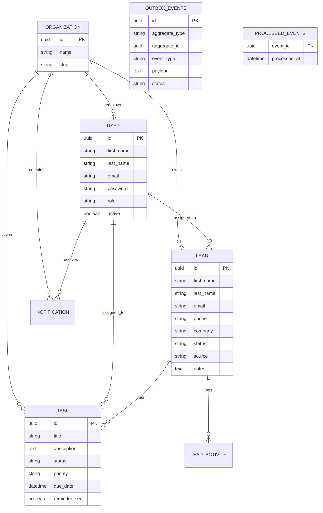

# FlowCRM

FlowCRM is a modern, enterprise-grade Customer Relationship Management (CRM) platform designed as a **Modular Monolith** with an event-driven backend and a responsive React frontend.

The platform provides end-to-end management for sales leads, task workflows, organization multi-tenancy, real-time notifications, and executive dashboards. Built with **Spring Boot 3** (Java 21) and **React 19**, FlowCRM incorporates production-grade distributed systems patterns—including **Transactional Outbox**, **Kafka Event Streaming**, **Redis Sliding-Window Rate Limiting**, **Redis Distributed Locking**, **Event Idempotency**, **Dead Letter Queues (DLQ)**, and **Cache-Aside Scoped Caching**.

### Main Users & Workflows
- **Admins**: Manage organization-wide leads and tasks, assign leads to team members, view system-wide dashboard metrics, and monitor audit trails.
- **Sales Representatives**: View assigned leads and tasks, progress lead pipeline stages, update task statuses using enforced workflow rules, receive follow-up notifications, and track personal sales performance.

---

# Features

- **Authentication & Authorization**: Secure JWT-based stateless authentication using Spring Security, supporting BCrypt password hashing and Role-Based Access Control (RBAC).
- **Multi-Tenancy & Tenant Isolation**: Organization-level data partitioning ensuring strict data isolation across organizations across all API queries.
- **User Management**: Support for `ADMIN` and `SALES_REP` user roles with scoped permissions.
- **Lead Management**: Full lifecycle management of leads across stages (`NEW`, `CONTACTED`, `QUALIFIED`, `DEMO_SCHEDULED`, `PROPOSAL_SENT`, `NEGOTIATION`, `WON`, `LOST`), sources (`WEBSITE`, `REFERRAL`, `EMAIL`, `SOCIAL_MEDIA`, `MANUAL`), lead assignments, and automated activity audit trails. Default search/filter and sorting (`createdAt DESC`).
- **Task Management**: Task creation, assignments, priority management (`LOW`, `MEDIUM`, `HIGH`, `URGENT`), due dates, overdue detection, and status workflow transitions (`PENDING`, `IN_PROGRESS`, `COMPLETED`) with backend-enforced status transition rules. Default search/filter and sorting (incomplete tasks by `dueDate ASC` before completed tasks by `updatedAt DESC`).
- **Notifications**: Automated in-app notifications generated asynchronously from domain events (such as `LeadAssigned` and `TaskFollowUpDue`) with enriched metadata.
- **Dashboard**: Real-time analytical dashboard presenting lead status distributions, task completion metrics, and overdue task counters, scoped by organization and role.
- **Redis Caching**: Cache-Aside implementation using Spring Cache and Jackson JSON serialization for dashboard metrics with organization and user-specific cache keys (`org:{orgId}:user:{userId}`) and automatic cache eviction on data mutations.
- **Rate Limiting**: Custom API rate limiter implemented via atomic Redis Lua scripts enforcing a sliding window algorithm to protect endpoints against brute force and abuse.
- **Distributed Locking**: Redis-backed distributed locking using atomic `SET NX EX` and Lua release scripts to prevent concurrent scheduled job execution across multi-node backend deployments.
- **Kafka & Event-Driven Processing**: Asynchronous event publishing and consuming using Apache Kafka topics (`leads.events`, `tasks.events`) with consumer group isolation.
- **Transactional Outbox Pattern**: Relational database outbox table (`outbox_events`) polled by a background job to guarantee atomicity between local database transactions and Kafka event dispatching without dual-write inconsistencies.
- **Idempotency & Deduplication**: Database-backed event deduplication (`processed_events` table) ensuring at-least-once Kafka messages are processed exactly once without duplicate side effects.
- **Dead-Letter Handling**: Automatic retries with backoff and Dead Letter Topic (`.DLT`) routing for unprocessable events.
- **Scheduled Jobs**: Background schedulers for task follow-up reminder evaluation and transactional outbox event publishing.
- **Observability**: Health checks and operational metrics via Spring Boot Actuator (`/actuator/health`, `/actuator/metrics`).
- **Swagger/OpenAPI**: Interactive API documentation generated via SpringDoc OpenAPI 3.0 at `/swagger-ui/index.html`.
- **React Frontend**: Modern single-page application built with React 19, Vite, Lucide React icons, Axios interceptors, and Toast notifications.

---

# Architecture

FlowCRM is designed as a **Modular Monolith** architecture with an event-driven core:



### Component Responsibilities
- **React Frontend**: Provides an interactive user interface for authentication, lead tracking, task status management, and dashboard visualization.
- **Spring Boot REST API**: Handles business logic, authentication, request validation, tenant scoping, and RESTful endpoint exposure.
- **PostgreSQL**: Serves as the primary ACID relational database for domain entities, outbox events, and processed event tracking.
- **Redis**: Provides low-latency caching for dashboard metrics, sliding-window rate limiting execution, and distributed locking.
- **Apache Kafka**: Acts as the asynchronous event streaming broker for decoupled notifications and background event handling.

---

# Technology Stack

| Technology | Purpose | Where Used |
| :--- | :--- | :--- |
| **Java 21** | Primary Programming Language | Entire Backend Application |
| **Spring Boot 3.4.3** | Web & Application Framework | Dependency Injection, MVC, Actuator |
| **Spring Security** | Authentication & Authorization | JWT Filter, RBAC, Security Rules |
| **Spring Data JPA / Hibernate** | ORM & Relational Data Access | Repositories, Database Entities |
| **PostgreSQL 18** | Primary Relational Database | Domain Tables, Outbox, Processed Events |
| **Redis 7** | Cache & In-Memory Store | Dashboard Caching, Rate Limiting, Locks |
| **Apache Kafka 7.5** | Asynchronous Event Streaming | Event Bus, Decoupled Notification Triggers |
| **React 19** | Frontend UI Framework | User Web Application (`frontend/`) |
| **Vite 8** | Frontend Build Tool | React Dev Server & Production Bundling |
| **Lucide React** | Iconography | Frontend Interface Components |
| **Axios** | HTTP Client | API Communication & Interceptor Handling |
| **SpringDoc OpenAPI 3.0** | API Documentation | Swagger UI & OpenAPI Schema Generation |
| **Docker & Docker Compose** | Containerization | Environment Infrastructure Setup |
| **Maven** | Build & Dependency Management | Backend Project Build |

---

# Backend Architecture

The backend follows a domain-driven modular package structure under `com.flowcrm`:

```text
com.flowcrm
├── auth/            # User authentication, registration, JWT security filter
├── lead/            # Lead lifecycle management, lead activities, specifications
├── task/            # Task management, status workflow, scheduler
├── notification/    # In-app notifications, metadata enrichment
├── dashboard/       # Dashboard metrics aggregation & caching
├── organization/    # Organization entity & tenant handling
├── outbox/          # Transactional outbox polling & event dispatching
├── kafka/           # Kafka topic consumers, event DTOs, deduplication
├── security/        # Rate limiting interceptor & security configurations
└── common/          # Audit entities, exception handling, Redis lock, cache config
```

### Layer Responsibilities
- **Controller Layer (`*Controller.java`)**: Handles HTTP requests, input validation (`@Valid`), OpenAPI documentation annotations, and maps service outputs to HTTP responses.
- **Service Layer (`*ServiceImpl.java`)**: Enforces core business logic, tenant access rules, state transitions, cache eviction, and transactional event publishing.
- **Repository Layer (`*Repository.java`, `*Specification.java`)**: Manages JPA queries, Criteria API dynamic filtering, and database access.
- **Entity Layer (`*.java`)**: Defines JPA domain models extending `BaseEntity` (providing `createdAt` and `updatedAt` audit timestamps).
- **DTO Layer (`*Request.java`, `*Response.java`)**: Java Records representing strongly typed API request/response payloads.
- **Common & Exception Handling (`GlobalExceptionHandler.java`)**: Centralizes exception processing and provides uniform error JSON representations.

### Request Execution Flow
```text
HTTP Request 
   ↓
[Security Filter (JWT Validation)] 
   ↓
[Rate Limiter Interceptor (Sliding Lua Window)] 
   ↓
[Controller Endpoint (DTO Validation)] 
   ↓
[Service Layer (Business Rules & Tenant Scoping)] 
   ↓
[Repository Layer (JPA / SQL Specification)] 
   ↓
[PostgreSQL Database]
   ↓
[Response Wrapper / ApiResponse<T>]
```

---

# Authentication & Security

FlowCRM implements stateless JWT authentication backed by Spring Security:

```text
Client Application                 Backend Server
      |                                  |
      |--- 1. POST /api/v1/auth/login -->| (Validate email & password via BCrypt)
      |<-- 2. JWT Access Token ----------| (Return Bearer token in response)
      |                                  |
      |--- 3. HTTP GET /api/v1/... ------>| (Header: Authorization: Bearer <token>)
      |                                  | [JwtAuthenticationFilter validates token]
      |                                  | [UserContext set in ThreadLocal]
      |<-- 4. HTTP 200 OK ---------------| (Protected Resource Access)
```

### Key Security Features
- **Stateless Sessions**: Configured with `SessionCreationPolicy.STATELESS` in `SecurityConfig.java`.
- **JWT Tokens**: Signed using `io.jsonwebtoken` (JJWT 0.12.7) containing user ID, email, role, and organization ID.
- **BCrypt Password Hashing**: Passwords are standardly hashed using `BCryptPasswordEncoder`.
- **User Context Injection**: `UserContext` bean retrieves authenticated user details and tenant organization IDs from `SecurityContextHolder` per thread.
- **CORS Configuration**: Restricts origin requests via `allowed-origins` configuration (`http://localhost:3000`, `http://localhost:5173`).
- **Role-Based Security**: Method-level (`@EnableMethodSecurity`) and URL-level path protection distinguishing `ADMIN` and `SALES_REP` capabilities.

---

# Multi-Tenancy / Organization Isolation

FlowCRM implements multi-tenancy through logical database isolation using an `Organization` model:

- **Entity Scoping**: Domain entities (`Lead`, `Task`, `User`, `Notification`) maintain an explicit `@ManyToOne` reference to `Organization`.
- **Tenant Context Extraction**: On every request, `UserContext` resolves the user's `organizationId` from the authenticated JWT context.
- **Repository-Level Filtering**: All data retrieval queries implicitly enforce organization boundaries:
  ```sql
  SELECT * FROM leads WHERE organization_id = :orgId AND ...
  ```
- **Role-Based Tenant Scoping**:
  - **`ADMIN`**: Accesses all leads and tasks within their organization.
  - **`SALES_REP`**: Accesses only leads and tasks assigned to them within their organization.

---

# Lead Management

The Lead module manages prospective customer interactions throughout the sales funnel.

### Supported Functionality
- **Lead Creation**: Registers new leads with details (`firstName`, `lastName`, `email`, `phone`, `company`, `source`, `notes`). Auto-assigns creator if unspecified.
- **Lead Pipeline Stages**:
  `NEW` → `CONTACTED` → `QUALIFIED` → `DEMO_SCHEDULED` → `PROPOSAL_SENT` → `NEGOTIATION` → `WON` / `LOST`
- **Lead Sources**: Supported options (`WEBSITE`, `REFERRAL`, `EMAIL`, `SOCIAL_MEDIA`, `MANUAL`).
- **Lead Assignment**: Admins (and reps assigned to the lead) can reassign leads. Emits a `LeadAssignedEvent`.
- **Activity Audit Trail**: Automatically records audit activities (`LEAD_CREATED`, `LEAD_UPDATED`, `STAGE_CHANGED`, `LEAD_ASSIGNED`) viewable via `/api/v1/leads/{leadId}/activities`.
- **Default Sorting**: Default query order presents newest leads first (`createdAt DESC`).

---

# Task Management

The Task module manages operational follow-up tasks associated with leads.

### Task Status Workflow Transition Rules
Backend rules in `TaskServiceImpl.java` strictly enforce allowed status transitions and reject invalid transitions with HTTP 400:



- **Priority Levels**: `LOW`, `MEDIUM`, `HIGH`, `URGENT`.
- **Default Sorting**: Incomplete tasks (`PENDING`, `IN_PROGRESS`) appear first ordered by `dueDate ASC`. Completed tasks (`COMPLETED`) appear after ordered by `updatedAt DESC`.

---

# Dashboard

The Dashboard module provides real-time aggregated metrics for organizations and sales representatives.

### Aggregated Metrics
- Total Leads count
- Lead count broken down by status (`NEW`, `QUALIFIED`, etc.)
- Total Tasks, Pending Tasks, Completed Tasks, and Overdue Tasks (`dueDate < NOW()` and `status != COMPLETED`).

### Dashboard Redis Caching
- **Cache Key**: Structured per tenant and user using `DashboardCacheKeyGenerator`:
  `org:{organizationId}:user:{userId}`
- **Cache TTL**: Defaults to 60 seconds (`app.cache.dashboard.ttl`).
- **Cache Invalidation**: Mutation operations in Lead or Task services trigger `@CacheEvict(value = "dashboard", allEntries = true)`.

---

# Redis Caching

Redis acts as the application's central high-performance cache and state manager.

```text
Service Method Call
       │
       ▼
Check Redis Cache ──(Hit)──► Return Serialized JSON Data
       │
    (Miss)
       │
       ▼
Query PostgreSQL Database
       │
       ▼
Populate Redis Cache (TTL) & Return Data
```

### Cache Configuration Details
- **Manager**: `RedisCacheManager` configured via `CacheConfig.java`.
- **Serializer**: `GenericJackson2JsonRedisSerializer` with polymorphic type validation.
- **Caches**:
  - `dashboard`: TTL = 60s
  - `userProfile`: TTL = 10 minutes
  - Defaults: TTL = 10 minutes

---

# Rate Limiting

FlowCRM employs a custom sliding-window rate limiter powered by Redis and Lua to prevent API spamming.

- **Interceptor**: `RateLimiterInterceptor.java` intercepts incoming HTTP requests.
- **Key Strategy**: Uses `user:{userId}` for authenticated calls or `ip:{clientIp}` for anonymous endpoints.
- **Lua Execution**: `SlidingWindowLuaLimiter.java` runs an atomic Lua script managing Redis Sorted Sets (`ZSET`).
- **Limit Defaults**: 60 requests per minute (`app.rate-limit.requests-per-minute`).
- **Exceeded Limit**: Throws `RateLimitExceededException`, returning HTTP `429 Too Many Requests` along with a `Retry-After` header.
- **Fault Tolerance**: Fails open (allows request) if Redis becomes unavailable.

---

# Distributed Locking

To prevent race conditions across multiple application instances during background jobs, FlowCRM provides `RedisDistributedLockService`.

- **Mechanism**: Atomic `SET lockKey lockValue NX EX ttl`.
- **Atomic Release**: Lua script verifies `lockValue` matches before deleting the key.
- **Usage**: `TaskFollowUpScheduler` acquires lock `lock:follow-up-reminder` (TTL 120s) before scanning and sending follow-up reminders.

---

# Scheduled Jobs

| Job Name | Frequency | Target / Operation | Lock Mechanism |
| :--- | :--- | :--- | :--- |
| **`TaskFollowUpScheduler`** | Every 60s (`app.follow-up.polling.fixed-delay`) | Scans tasks with `dueDate <= NOW()` where `reminderSent = false`. Marks `reminderSent = true` and emits `TaskFollowUpDue` outbox event. | `RedisDistributedLockService` (`lock:follow-up-reminder`) |
| **`OutboxPoller`** | Every 5s (`outbox.polling.fixed-delay`) | Scans `outbox_events` table where `status = PENDING`. Publishes events to Kafka (`leads.events`, `tasks.events`) and updates outbox status to `PUBLISHED` or `FAILED`. | Database row ordering & transactional state update |

---

# Kafka & Event-Driven Architecture

FlowCRM utilizes Apache Kafka for event-driven decoupled communication.



### Event Topics & Consumers
- **Topics**: `leads.events`, `tasks.events`.
- **Consumers**: `LeadEventConsumer.java`, `TaskEventConsumer.java`.
- **Consumer Group**: `flowcrm-monolith`.
- **Retry & DLT**: Configured with `@RetryableTopic(attempts = 3, backOff = @BackOff(delay = 1000))` routing unprocessable messages to `.DLT` topics (e.g. `leads.events.DLT`).

---

# Transactional Outbox Pattern

To avoid the "dual-write" problem (where a database commit succeeds but a direct message broker publish fails), FlowCRM implements the **Transactional Outbox Pattern**:

1. **Atomic Write**: Domain updates (e.g., updating a lead assignment) and the corresponding `OutboxEvent` are saved in the **same database transaction**.
2. **Polling**: `OutboxPoller` fetches `PENDING` outbox records.
3. **Dispatch**: Outbox events are serialized and sent to Kafka.
4. **Completion**: Upon successful broker acknowledgment, outbox records are updated to `PUBLISHED`.

---

# Idempotency

Event consumer processing (`EventProcessingService.java`) guarantees idempotent execution:

- **Store**: Uses PostgreSQL `processed_events` table storing `eventId` (UUID primary key).
- **Check**: Before processing any event payload, the service checks:
  ```java
  if (processedEventRepository.existsById(eventId)) {
      return false; // Skip duplicate execution
  }
  ```
- **Concurrency Safety**: Unique primary key constraint catches concurrent execution attempts (`DataIntegrityViolationException`), safely ignoring duplicate events.

---

# N+1 Query Prevention

FlowCRM prevents N+1 query performance degradation using optimized JPA strategies:
- **Custom Aggregation Queries**: Dashboard repository queries use SQL group-by aggregations (`countLeadsByStatusForAdmin`) returning `List<Object[]>` instead of fetching full entity collections.
- **Fetch Joins & Projections**: Entity relationships are mapped with `FetchType.LAZY` by default, and audit activity history queries fetch indexed relations directly (`findByLeadIdOrderByCreatedAtDesc`).

---

# Exception Handling

Global exception processing is handled centrally by `GlobalExceptionHandler.java`:

### Standardized Error Structure (`ErrorResponse`)
```json
{
  "status": 400,
  "message": "Validation failed",
  "timestamp": "2026-08-14T19:20:00.123",
  "path": "/api/v1/leads",
  "errors": {
    "email": "Email should be valid",
    "firstName": "First name is required"
  }
}
```

### Handled Exceptions & Status Codes
- `MethodArgumentNotValidException` / `ConstraintViolationException` → `400 Bad Request`
- `IllegalArgumentException` (e.g., invalid status transition) → `400 Bad Request`
- `ResourceNotFoundException` → `404 Not Found`
- `EmailAlreadyExistsException` / `OrganizationAlreadyExistsException` → `409 Conflict`
- `BadCredentialsException` / `InvalidTokenException` → `401 Unauthorized`
- `AccessDeniedException` → `403 Forbidden`
- `RateLimitExceededException` → `429 Too Many Requests` (includes `Retry-After` header)

---

# API Documentation

FlowCRM provides interactive OpenAPI documentation via SpringDoc:

- **Swagger UI Endpoint**: `http://localhost:8080/swagger-ui/index.html`
- **OpenAPI Schema Document**: `http://localhost:8080/v3/api-docs`

The Swagger UI is configured with Bearer Token JWT authentication support, allowing developers to authorize and test API endpoints directly from the browser.

---

# API Response Structure

All write and success API responses are wrapped in a standard `ApiResponse<T>` structure:

### Success Response Example (`ApiResponse<T>`)
```json
{
  "success": true,
  "message": "Lead created successfully",
  "data": {
    "id": "c39e248a-6371-4770-8d1e-841961e66c1b",
    "firstName": "Jane",
    "lastName": "Doe",
    "email": "jane.doe@example.com",
    "phone": "+1234567890",
    "company": "Acme Corp",
    "status": "NEW",
    "source": "WEBSITE",
    "notes": "Interested in enterprise tier",
    "assignedTo": "a81d4f21-7212-4c91-b3b2-9118c728e102",
    "assignedToName": "John Sales",
    "createdAt": "2026-08-14T18:00:00",
    "updatedAt": "2026-08-14T18:00:00"
  }
}
```

---

# Database Design



---

# Security Considerations

- **JWT Token Lifetime**: Configured with 24-hour access token expiration (`jwt.access-token-expiration-ms: 86400000`).
- **Stateless Authorization**: No server-side session state stored; tokens validated cryptographically on each request.
- **Input Sanitization & Validation**: Request DTOs strictly annotated with `@NotBlank`, `@Email`, and custom validations.
- **Environment Secret Externalization**: Production secret keys (`JWT_SECRET_KEY`, database credentials) overridden via environment variables.

---

# Performance & Scalability

### Implemented Performance Features
- **Redis Distributed Caching**: Eliminates redundant database reads for dashboard analytical counts.
- **Sliding-Window Rate Limiting**: Protects backend service compute resources against request bursts.
- **Database Indexing**: Explicit database indexes added on `assigned_to`, `status`, `due_date`, `lead_id`, and `organization_id`.
- **Outbox Asynchronous Decoupling**: Offloads background event notifications from synchronous REST request threads.

### Potential Future Improvements
- **Read Replicas**: Routing database read operations to read-only PostgreSQL replicas.
- **Elasticsearch Integration**: Full-text search engine for complex lead search across millions of records.

---

# Deployment

FlowCRM includes containerized deployment files ready for Docker environments.

### Production Profile Configuration (`application-prod.yml`)
- Activates on `SPRING_PROFILES_ACTIVE=prod`.
- Expects external environment variables for external managed databases and brokers.

### Required Production Environment Variables
```env
PORT=8080
DB_URL=jdbc:postgresql://postgres-host:5432/flowcrm-db
DB_USER=flowcrm_user
DB_PASS=secure_db_password
REDIS_HOST=redis-host
REDIS_PORT=6379
REDIS_PASSWORD=secure_redis_password
KAFKA_BROKERS=kafka-host:9092
JWT_SECRET_KEY=your-256-bit-production-secret-key-here
CORS_ALLOWED_ORIGINS=https://app.yourdomain.com
```

---

# Local Development

### Prerequisites
- Java 21 JDK
- Node.js (v18+) & npm
- Docker & Docker Compose

### Step 1: Clone Repository
```bash
git clone https://github.com/Rakshitshetty5/CRM.git
cd flowcrm
```

### Step 2: Start Infrastructure Services (PostgreSQL, Redis, Kafka)
```bash
docker-compose up -d
```

### Step 3: Run Backend Application
```bash
./mvnw spring-boot:run
```
The backend API will be available at `http://localhost:8080`.

### Step 4: Run React Frontend
```bash
cd frontend
npm install
npm run dev
```
The frontend application will be available at `http://localhost:5173`.

---

# Configuration

### Development (`application.yml`) vs Production (`application-prod.yml`)
- **Development**: Features auto-updating database schema (`ddl-auto: update`), enabled SQL logging, and local Docker connection defaults.
- **Production**: Enforces database schema validation (`ddl-auto: validate`), disables SQL output, and mandates environment variables for secrets.

---

# Project Structure

```text
flowcrm/
├── src/main/java/com/flowcrm/
│   ├── auth/                # Security authentication & user service
│   ├── lead/                # Lead controllers, services, repositories
│   ├── task/                # Task controllers, status workflow, scheduler
│   ├── notification/        # In-app notifications & metadata parsing
│   ├── dashboard/           # Analytics calculation & caching logic
│   ├── organization/        # Tenant organization entity
│   ├── outbox/              # Outbox entity, poller, event publisher
│   ├── kafka/               # Kafka consumer listeners & deduplication
│   ├── security/            # Rate limiting interceptor & filter chain
│   └── common/              # Global exceptions, Redis locks, audit entity
├── frontend/
│   ├── src/
│   │   ├── api/             # Axios API client & interceptors
│   │   ├── components/      # Header, Navigation, Modals
│   │   ├── context/         # AuthContext state manager
│   │   ├── pages/           # Dashboard, Leads, Tasks, Notifications, Profile
│   │   └── index.css        # Centralized SaaS design tokens & rules
│   ├── package.json
│   └── vite.config.js
├── Dockerfile               # Multi-stage Java 21 Alpine Docker image
├── docker-compose.yaml      # PostgreSQL, Redis, Kafka, Control Center
├── pom.xml                  # Maven build configuration
└── README.md
```

---

# Important Design Patterns

- **Layered Architecture**: Strict separation between Web Controller, Business Service, and Data Access Repository layers.
- **DTO Pattern**: Separation of internal JPA database entities from public API payloads using Java Records.
- **Cache-Aside Pattern**: Application checks Redis before falling back to PostgreSQL, populating the cache on miss.
- **Transactional Outbox Pattern**: Ensures reliable event publishing without dual-write transactional failures.
- **Idempotent Consumer Pattern**: Deduplicates incoming Kafka messages using database primary key checks.
- **Distributed Lock Pattern**: Prevents concurrent execution of background scheduled jobs across application instances.
- **Role-Based Access Control (RBAC)**: Fine-grained security scoping based on user roles (`ADMIN` vs `SALES_REP`).

---

# Request / Data Flow Examples

### 1. Create Lead Flow
```text
React Form ──(POST /api/v1/leads)──► RateLimiterInterceptor ──► LeadController
                                                                       │
PostgreSQL ◄──[Commit Lead & Outbox Event]── LeadServiceImpl ◄─────────┘
    │
OutboxPoller ──(Poll Pending)──► Kafka Broker (leads.events) ──► LeadEventConsumer
                                                                       │
Notifications Table ◄──[Create In-App Notification]── EventProcessingService
```

### 2. Task Status Update & Transition Enforcement Flow
```text
React Status Toggle ──(PATCH /api/v1/tasks/{id}/status)──► TaskController
                                                                  │
TaskServiceImpl ──► Validate Transition (COMPLETED -> IN_PROGRESS rejected)
       │
       ▼ (If valid)
Save Task in PostgreSQL ──► Evict Dashboard Cache in Redis ──► Return ApiResponse
```

---

# Production Considerations

### Implemented
- Multi-stage Dockerfile build using Java 21 JRE Alpine image.
- Non-root container user setup (`USER spring:spring`).
- Database indexing on query filter columns.
- Redis sliding-window rate limiting.
- Distributed lock protection on background jobs.
- Transactional Outbox and Event Deduplication.

### Before Real Production
- **Secret Management**: Replace environment variable files with AWS Secrets Manager or HashiCorp Vault.
- **Managed Cloud Services**: Deploy AWS RDS for PostgreSQL, AWS ElastiCache for Redis, and MSK for Kafka.
- **Database Migrations**: Integrate Flyway or Liquibase for versioned database schema migration scripts.
- **TLS/HTTPS**: Terminate SSL/TLS at ingress proxies or load balancers.

---

# Future Improvements

- **Database Migration Tooling**: Integration of Liquibase/Flyway for version-controlled DB migrations.
- **Distributed Tracing**: Integration of OpenTelemetry and Jaeger for request tracing across Kafka consumers.
- **Metrics Aggregation**: Exporting Prometheus metrics to Grafana dashboards.
- **CI/CD Pipeline**: GitHub Actions workflow for automated testing and container publishing.

---

# Learning / Architecture Concepts

- **Transactional Outbox**: Solves data inconsistency by persisting events to a local DB table within the domain transaction before emitting to Kafka.
- **Sliding-Window Rate Limiting**: Provides smooth, accurate rate limiting using Redis Sorted Sets (`ZSET`) and Lua scripts, preventing burst spikes.
- **Distributed Locking**: Ensures that cron/scheduled jobs run on only one instance at a time in multi-instance deployments.
- **Idempotent Message Processing**: Prevents duplicate event processing by recording processed message IDs in a relational table.
- **Cache Invalidation**: Guarantees stale cache data is cleared immediately upon write mutations using Spring `@CacheEvict`.